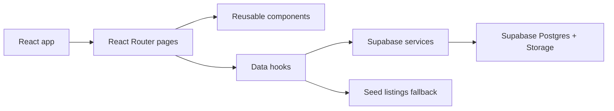

# Architecture

GearLoop is a Vite React MVP with a Supabase-backed marketplace path and a seed-data fallback for demos.

## Runtime flow

## Directory map

- `src/pages`: Route-level screens. Pages compose components and hooks.
- `src/components`: Reusable UI and workflow components.
- `src/hooks`: Client-side data loading and URL/query helpers.
- `src/services`: Side-effectful operations, including Supabase reads/writes/uploads.
- `src/lib`: Third-party client setup.
- `src/data`: Seed data and static category data.
- `src/types`: Shared TypeScript domain models.
- `src/utils`: Pure business logic for pricing, filtering, sorting, and validation.
- `supabase/schema.sql`: Database tables, indexes, storage bucket, and MVP RLS policies.
- `docs`: Team-facing architecture and workflow notes.

## Data source strategy

`src/services/listingService.ts` is the boundary between UI code and data persistence.

- If Supabase env vars are missing, browsing/detail pages use `src/data/listings.ts`.
- If Supabase env vars exist, listing reads and writes go through Supabase.
- Listing image uploads go to the `listing-images` Storage bucket.
- Booking requests are inserted into `booking_requests` when Supabase is configured.

This keeps local demos working while making the production path real once Supabase is configured.

## Current product boundaries

Implemented:

- Marketplace browsing and filters
- Listing detail pages
- Supplier listing creation
- Listing image uploads
- Rental request persistence
- Supabase schema and storage policies

Not implemented yet:

- Authentication
- Shop dashboards
- Listing moderation queues
- Payment collection
- Real availability calendars
- Messaging
- Reviews

## Adding a new feature

1. Add or update the shared type in `src/types`.
2. Add pure calculations or validation in `src/utils`.
3. Add Supabase reads/writes in `src/services`.
4. Add a hook in `src/hooks` if a page needs async state.
5. Compose UI in `src/components`.
6. Keep route-level orchestration in `src/pages`.
7. Update `supabase/schema.sql` and docs if persistence changes.
